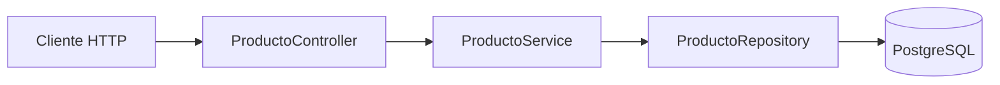
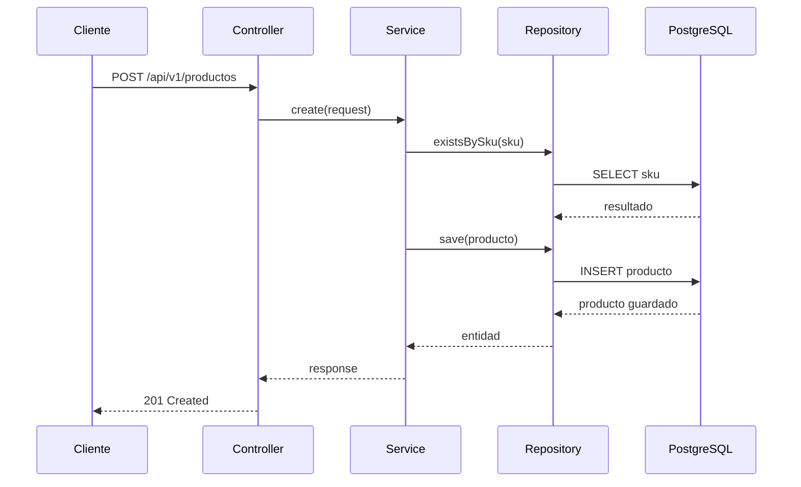
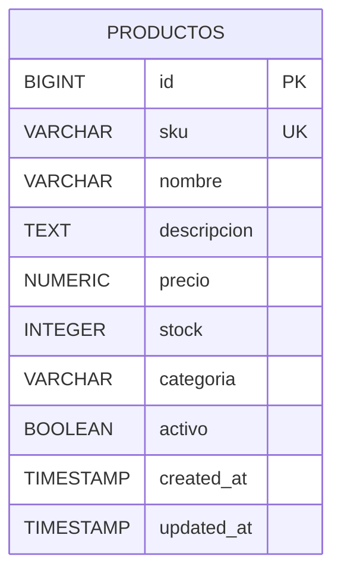
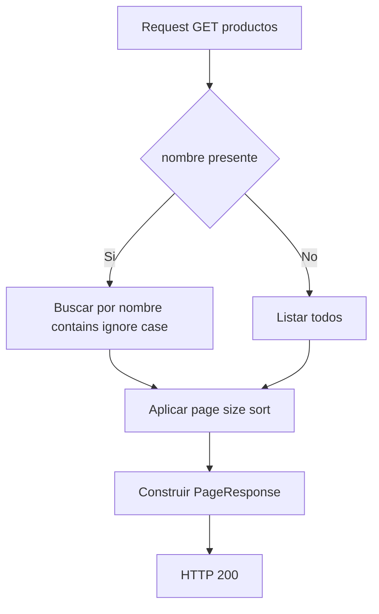

# CRUD Basico de Productos con Spring Boot

Proyecto de aprendizaje para construir un CRUD REST con Java 21, Spring Boot 3, PostgreSQL, Flyway, Swagger y Docker.

## A) Que aprenderas con este proyecto

- Estructura por capas: controller, service, repository.
- Uso de DTOs para separar entidad y API.
- Validaciones con Bean Validation.
- Paginacion y busqueda por nombre con Spring Data JPA.
- Manejo global de errores con respuesta consistente.
- Migraciones con Flyway.
- Documentacion con Swagger/OpenAPI.
- Pruebas unitarias e integracion.
- Ejecucion local con Docker Compose.

## B) Requisitos previos

- Java 21
- Maven 3.9+
- Docker y Docker Compose

## C) Como correr con Docker

1. Construir y levantar servicios:

```bash
docker-compose up --build
```

2. URLs importantes:

- Swagger UI: `http://localhost:8080/swagger-ui.html`
- OpenAPI JSON: `http://localhost:8080/v3/api-docs`
- Base endpoint: `http://localhost:8080/api/v1/productos`

## D) Como correr tests

```bash
mvn test
```

## E) Ejemplos curl

Crear producto:

```bash
curl -X POST "http://localhost:8080/api/v1/productos" \
  -H "Content-Type: application/json" \
  -d '{
    "sku": "SKU-5001",
    "nombre": "Mouse Vertical",
    "descripcion": "Mouse ergonomico",
    "precio": 159.90,
    "stock": 20,
    "categoria": "Perifericos",
    "activo": true
  }'
```

Listar productos (default):

```bash
curl "http://localhost:8080/api/v1/productos"
```

Listar con paginacion:

```bash
curl "http://localhost:8080/api/v1/productos?page=0&size=5&sort=createdAt,desc"
```

Listar con filtro por nombre:

```bash
curl "http://localhost:8080/api/v1/productos?nombre=mouse&page=0&size=10"
```

Obtener por id:

```bash
curl "http://localhost:8080/api/v1/productos/1"
```

Actualizar:

```bash
curl -X PUT "http://localhost:8080/api/v1/productos/1" \
  -H "Content-Type: application/json" \
  -d '{
    "sku": "SKU-5001",
    "nombre": "Mouse Vertical Pro",
    "descripcion": "Mouse ergonomico actualizado",
    "precio": 179.90,
    "stock": 25,
    "categoria": "Perifericos",
    "activo": true
  }'
```

Eliminar:

```bash
curl -X DELETE "http://localhost:8080/api/v1/productos/1"
```

## F) Estructura del proyecto

```text
src/main/java/com/jamnd/crudbasic
  |- config            -> Configuracion OpenAPI
  |- controller        -> Endpoints REST
  |- dto               -> Request/Response DTOs y pagina
  |- entity            -> Entidad JPA Producto
  |- exception         -> Excepciones y ControllerAdvice
  |- mapper            -> Conversion entidad <-> DTO
  |- repository        -> Acceso a datos con JPA
  |- service           -> Logica de negocio

src/main/resources
  |- application*.yml  -> Configuracion por perfil
  |- db/migration      -> Scripts Flyway

src/test/java/com/jamnd/crudbasic
  |- controller        -> Unit test MockMvc
  |- service           -> Unit test Mockito
  |- integration       -> Integration test con SpringBootTest + H2
```

## G) Paginacion y filtro por nombre

- Endpoint: `GET /api/v1/productos`
- Parametros:
- `page` (default `0`)
- `size` (default `10`)
- `sort` (default `createdAt,desc`)
- `nombre` (opcional, contains ignore case)
- Si `nombre` llega, se usa filtro por nombre.
- Si `nombre` no llega, se listan todos.
- La respuesta contiene:
- `content`, `page`, `size`, `totalElements`, `totalPages`

## H) Troubleshooting basico

- Error de conexion a DB:
- Verifica que `postgres` este healthy en `docker-compose ps`.
- Revisa `DB_URL`, `DB_USERNAME`, `DB_PASSWORD`.
- Error de puerto ocupado:
- Cambia `8080:8080` o `5432:5432` en `docker-compose.yml`.
- Error de migraciones:
- Revisa scripts en `src/main/resources/db/migration`.
- Si cambias scripts ya aplicados, reinicia volumen:

```bash
docker-compose down -v
docker-compose up --build
```

## I) Diagramas Mermaid

### 1) Arquitectura



### 2) Secuencia Crear producto



### 3) ERD tabla productos



### 4) Flujo Listar productos con paginacion y filtro


CRUD basico con java y postgress
